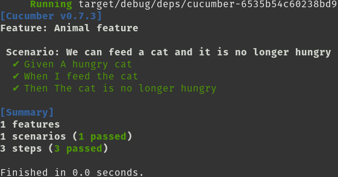
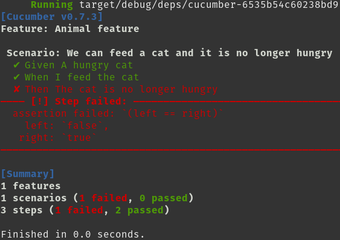

# Getting Started

Adding Cucumber to your project requires some ground work. Cucumber tests are ran along with other tests via `cargo test`, but rely on a `.feature` file corresponding to the given test, as well as a set of steps described in code that corresponds to the steps in the feature file.

To start, create a directory called `tests/` in the root of your project and add a file to represent your test target; in this walkthrough we use `cucumber.rs`.

Add this to your Cargo.toml:

```
[dependencies]
async-trait = "0.1.42" # This is currently required to properly initialize the world in cucumber-rust

[[test]]
name = "cucumber" # This should be the same as the filename of your test target
harness = false # Allows Cucumber to print output instead of libtest

[dev-dependencies]
cucumber = { package = "cucumber_rust", version = "^0.7.0" }
```

At this point, while it won't do anything, you should be able to successfully run `cargo test --test cucumber` without errors as long as your `cucumber.rs` has at least a `main()` function.

Create a directory called `features/` in the root of your project. Put a feature file there, such as `animal.feature`. This should contain the Gherkin for a scenario that you want to test. Here's a very simple example:

```
Feature: Animal feature

  Scenario: If we feed a hungry cat it will no longer be hungry
    Given A hungry cat
    When I feed the cat
    Then The cat is not hungry

```

Here is how we actually relate the text in this feature file to the tests themselves.

Every test scenario needs a `World` object. Often `World` holds state that is changing as Cucumber goes through each step in a scenario. The basic requirement for a `World` object is a `new()` function.

To enable testing of our Animal feature, add this code to `cucumber.rs`:

```
use async_trait::async_trait;
use std::convert::Infallible;

// These `Cat` definitions would normally be inside your project's code, but
// we create them here to contain the test to just `cucumber.rs`
struct Cat {
    pub hungry: bool,
}

impl Cat {
    fn feed(&mut self) {
        self.hungry = false;
    }
}

/// A World is your shared, likely mutable state
pub struct AnimalWorld {
    cat: Cat,
}

/// `cucumber::World` needs to be implemented so this World is accepted in `Steps`
#[async_trait(?Send)]
impl cucumber::World for AnimalWorld {
    // We require some error type
    type Error = Infallible;

    async fn new() -> Result<Self, Infallible> {
        Ok(Self {
            cat: Cat { hungry: false },
        })
    }
}

// These are the actual test steps that will be matched against all your features
mod addition_steps {
    use cucumber::Steps;

    pub fn steps() -> Steps<crate::AnimalWorld> {
        let mut builder: Steps<crate::AnimalWorld> = Steps::new();

        builder
            .given("A hungry cat", |mut world, _step| {
                world.cat.hungry = true;
                world
            });

        builder
    }
}

// This runs before everything else, so you can setup things here
fn main() {
    let runner = cucumber::Cucumber::<AnimalWorld>::new()
        .features(&["./features"])
        .steps(addition_steps::steps());

    // You may choose any executor you like (Tokio, async-std, etc)
    // You may even have an async main, it doesn't matter. The point is that
    // Cucumber is composable. :)
    futures::executor::block_on(runner.run());
}
```

If you run this, you should see an output like:


You will see a checkmark next to "Given A hungry cat", which means that test step has been matched and executed.

But then for the next step: "I feed the cat", there is a "⚡ Not yet implemented (skipped)" below it. This is because we have nothing in our steps that matches this sentence. The remaining steps in the scenario, since they depend on this skipped one, are not looked at at all.

The steps are created as such:

```
builder
    .given("A hungry cat", |mut world, _step| {
        world.cat.hungry = true;
        world
    });
```

There are 3 types of steps:

- given, which is for defining the starting conditions and often initializing the data in the `World`
- when, for events or actions that are may trigger certain changes in the `World`
- then, to validate that the `World` has changed the way we would expect

In order to hook up code to these steps, we use the functions provided by `cucumber-rust`: https://docs.rs/cucumber_rust/0.7.3/cucumber_rust/struct.Steps.html

These various Steps functions are executed to transform the world and then return it. As such, the world must always be passed in. The step itself is also made available.

The steps functions take a string, which is the name of the given `Step` (i.e., the literal string, such as "A hungry cat"), and then a function closure that takes a `World` and then the `Step` itself. 

We can add a `when` step after our `given` step:

```
builder
    .given("A hungry cat", |mut world, _step| {
        world.cat.hungry = true;
        world
    })
    .when("I feed the cat", |mut world, _step| {
        world
    });
```

If you run the tests again, you'll see that two lines are green now and the next one is marked as not yet implemented:


But we should actually do something in our When step so we can test our Animal feature. Or When step mentions feeding the cat, so let's change the `when()`:

```
    .when("I feed the cat", |mut world, _step| {
        world.cat.feed();
        world
    });
```

Finally, how do we validate our result? We expect that this will cause some change in the cat and that the cat will no longer be hungry since it has been fed. The `then()` step follows to assert this, as our feature says:

```
builder
    .given("A hungry cat", |mut world, _step| {
        world.cat.hungry = true;
        world
    })
    .when("I feed the cat", |mut world, _step| {
        world.cat.feed();
        world
    })
    .then("The cat is not hungry", |world, _step| {
        assert_eq!(world.cat.hungry, false);
        world
    });
```

If you run the test now, you'll see that all steps are accounted for and the test succeeds:



If you want to be assured that your validation is indeed happening, you can change the assert for the cat being hungry from `true` to `false` temporarily:

```
builder
    .given("A hungry cat", |mut world, _step| {
        world.cat.hungry = true;
        world
    })
    .when("I feed the cat", |mut world, _step| {
        world.cat.feed();
        world
    })
    .then("The cat is not hungry", |world, _step| {
        assert_eq!(world.cat.hungry, true);
        world
    });
```

And you should see the test fail:



What if we also wanted to validate that even if the cat was never hungry to begin with, it wouldn't end up hungry after it was fed? We can add another scenario that looks quite similar:

```
Feature: Animal feature

  Scenario: If we feed a hungry cat it will no longer be hungry
    Given A hungry cat
    When I feed the cat
    Then The cat is not hungry

  Scenario: If we feed a satiated cat it will not become hungry
    Given A satiated cat
    When I feed the cat
    Then The cat is not hungry

```

The only thing that is different is the Given. That is then the only new step we need to add to our builder (remember that the order of the steps, or the relationship between them, is expressed in the `.feature` file and not in the code):

```
builder
    .given("A hungry cat", |mut world, _step| {
        world.cat.hungry = true;
        world
    })
    .given("A satiated cat", |mut world, _step| {
        world.cat.hungry = true;
        world
    })
    .when("I feed the cat", |mut world, _step| {
        world.cat.feed();
        world
    })
    .then("The cat is not hungry", |world, _step| {
        assert_eq!(world.cat.hungry, false);
        world
    });
```

Cucumber reuses the steps:


A contrived example, but this demonstrates that steps can be reused as long as they are sufficiently precise in both their description and implementation. If, for example, the wording for our "Then" step was "The cat is no longer hungry", it'd imply something about the expected initial state, when that is not the purpose of a "Then" step, but rather of the "Given" step.
