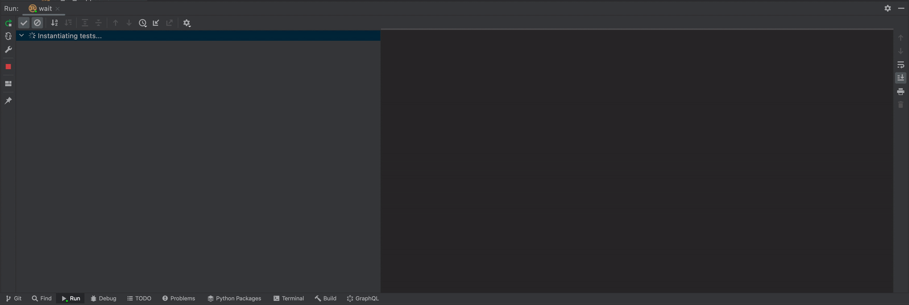

IntelliJ Rust
=============

With feature `libtest` (enabled by default), IDE with [IntelliJ Rust] plugin can interpret output of [`cucumber`] test similar to unit tests. To use it, just add [Cargo configuration] (current example uses `cargo test --test wait` command) or run it via [Cargo command]. This automatically adds `--format=json` CLI option, which makes [`cucumber`] output IDE-compatible.

> __NOTE__: There are currently 2 caveats with [IntelliJ Rust] integration:
> 1. Because of [output interpretation issue], current timing reports for individual tests are accurate only for serial tests (or in case `--concurrency=1` CLI option is used);
> 2. Although debugger works, test window may select `Step` that didn't trigger the breakpoint. To fix this, use `--concurrency=1` CLI option.

[`cucumber`]: https://docs.rs/cucumber
[output interpretation issue]: https://github.com/intellij-rust/intellij-rust/issues/9041
[Cargo command]: https://plugins.jetbrains.com/plugin/8182-rust/docs/cargo-command-configuration.html
[Cargo configuration]: https://plugins.jetbrains.com/plugin/8182-rust/docs/rust-testing.html
[IntelliJ Rust]: https://www.jetbrains.com/rust/
