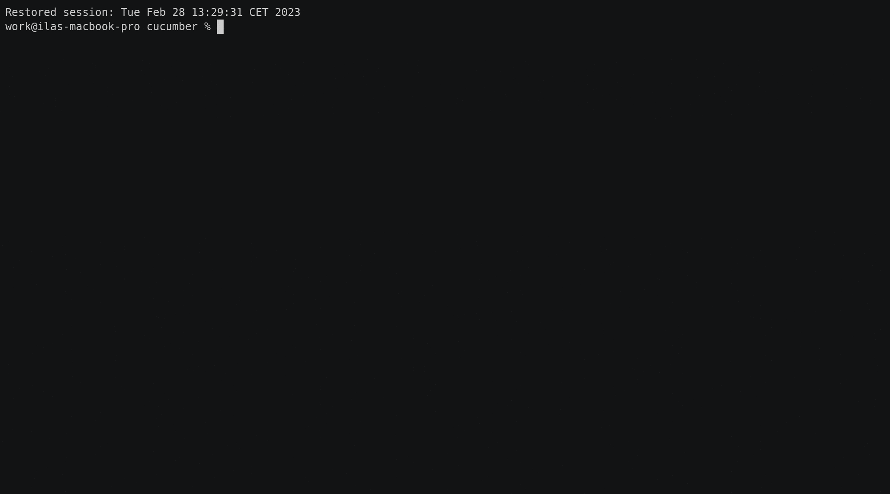

`tracing` integration
=====================

[`Cucumber::init_tracing()`] (enabled by `tracing` feature in `Cargo.toml`) initializes global [`tracing::Subscriber`] that intercepts all the [`tracing` events][1] and transforms them into [`event::Scenario::Log`]s. Each [`Writer`] can handle those [`event::Scenario::Log`]s in its own way. [`writer::Basic`], for example, emits all the [`event::Scenario::Log`]s only whenever [scenario] itself is outputted.

```rust
# extern crate cucumber;
# extern crate tokio;
# extern crate tracing;
#
use std::{
    sync::atomic::{AtomicUsize, Ordering},
    time::Duration,
};

use cucumber::{given, then, when, World as _};
use tokio::time;

#[derive(cucumber::World, Debug, Default)]
struct World;

#[given(regex = r"(\d+) secs?")]
#[when(regex = r"(\d+) secs?")]
#[then(regex = r"(\d+) secs?")]
async fn sleep(_: &mut World, secs: u64) {
    static ID: AtomicUsize = AtomicUsize::new(0);

    let id = ID.fetch_add(1, Ordering::Relaxed);

    tracing::info!("before {secs}s sleep: {id}");
    time::sleep(Duration::from_secs(secs)).await;
    tracing::info!("after {secs}s sleep: {id}");
}

#[tokio::main]
async fn main() {
    World::cucumber()
        .init_tracing()
        .run("tests/features/wait")
        .await;
}
```


## Loosing [`tracing::Span`]

[`tracing::Span`] is used to wire emitted [`tracing` events][1] (logs) to concrete [scenario]s: each [scenario] is executed in its own [`tracing::Span`]. In case a [`tracing` event][1] is emitted outside the [`tracing::Span`] of a [scenario], it will be propagated to every running [scenario] at the moment.

```rust
# extern crate cucumber;
# extern crate tokio;
# extern crate tracing;
#
# use std::{
#     sync::atomic::{AtomicUsize, Ordering},
#     time::Duration,
# };
# 
# use cucumber::{given, then, when, World as _};
# use tokio::time;
# 
# #[derive(cucumber::World, Debug, Default)]
# struct World;
# 
# #[given(regex = r"(\d+) secs?")]
# #[when(regex = r"(\d+) secs?")]
# #[then(regex = r"(\d+) secs?")]
# async fn sleep(_: &mut World, secs: u64) {
#     static ID: AtomicUsize = AtomicUsize::new(0);
# 
#     let id = ID.fetch_add(1, Ordering::Relaxed);
# 
#     tracing::info!("before {secs}s sleep: {id}");
#     time::sleep(Duration::from_secs(secs)).await;
#     tracing::info!("after {secs}s sleep: {id}");
# }
# 
#[tokio::main]
async fn main() {
    // Background task outside of any scenario.
    tokio::spawn(async {
        let mut id = 0;
        loop {
            time::sleep(Duration::from_secs(3)).await;
            tracing::info!("Background: {id}");
            id += 1;
        }
    });

    World::cucumber()
        .init_tracing()
        .run("tests/features/wait")
        .await;
}
```


As we see, `Background: 2`/`3`/`4` is shown in multiple [scenario]s, while being emitted only once each.

> __TIP__: If you're [`spawn`]ing a [`Future`] inside your [step] matching function, consider to [propagate][2] its [`tracing::Span`] into the [`spawn`]ed [`Future`] for outputting its logs properly.


[`Cucumber::init_tracing()`]: https://docs.rs/cucumber/*/cucumber/struct.Cucumber.html#method.init_tracing
[`event::Scenario::Log`]: https://docs.rs/cucumber/*/cucumber/event/enum.Scenario.html#variant.Log
[`Future`]: https://doc.rust-lang.org/stable/std/future/trait.Future.html
[`spawn`]: https://docs.rs/tokio/*/tokio/fn.spawn.html
[`tracing::Span`]: https://docs.rs/tracing/*/tracing/struct.Span.html
[`tracing::Subscriber`]: https://docs.rs/tracing/*/tracing/trait.Subscriber.html
[`Writer`]: https://docs.rs/cucumber/*/cucumber/writer/trait.Writer.html
[`writer::Basic`]: https://docs.rs/cucumber/*/cucumber/writer/struct.Basic.html
[scenario]: https://cucumber.io/docs/gherkin/reference#example
[step]: https://cucumber.io/docs/gherkin/reference#steps
[1]: https://docs.rs/tracing/*/tracing/index.html#events
[2]: https://docs.rs/tracing/*/tracing/struct.Span.html#method.enter
