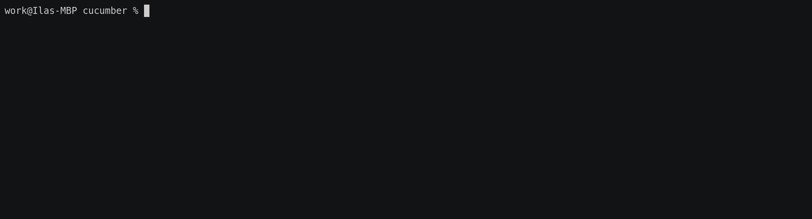

Capturing and variation
=======================

Using [regular expressions][regex] or [Cucumber Expressions][expr] for our [step] matching functions allows us:
- to capture values from a [step] and use them inside a test function;
- to match variations of a [step] with a single test function.


## Regular expressions

Using a [regular expression][regex] for a [step] matching function is possible with `regex =` attribute modifier:
```rust
# use std::convert::Infallible;
#
# use async_trait::async_trait;
# use cucumber::{given, then, when, World, WorldInit};
#
# #[derive(Debug)]
# struct Cat {
#     pub hungry: bool,
# }
#
# impl Cat {
#     fn feed(&mut self) {
#         self.hungry = false;
#     }
# }
#
# #[derive(Debug, WorldInit)]
# pub struct AnimalWorld {
#     cat: Cat,
# }
#
# #[async_trait(?Send)]
# impl World for AnimalWorld {
#     type Error = Infallible;
#
#     async fn new() -> Result<Self, Infallible> {
#         Ok(Self {
#             cat: Cat { hungry: false },
#         })
#     }
# }
#
#[given(regex = r"^a (hungry|satiated) cat$")]
fn hungry_cat(world: &mut AnimalWorld, state: String) {
    match state.as_str() {
        "hungry" =>  world.cat.hungry = true,
        "satiated" =>  world.cat.hungry = false,
        _ => unreachable!(),
    }
}

#[when(regex = r"^I feed the cat \d+ times?$")]
fn feed_cat(world: &mut AnimalWorld) {
    world.cat.feed();
}
#
# #[then("the cat is not hungry")]
# fn cat_is_fed(world: &mut AnimalWorld) {
#     assert!(!world.cat.hungry);
# }
#
# #[tokio::main]
# async fn main() {
#     AnimalWorld::run("tests/features/book/writing/capturing.feature").await;
# }
```
> __NOTE__: We surround the [regex] with `^..$` to ensure an __exact__ match. This is much more useful when adding more and more [step]s, so they won't accidentally interfere with each other.


> __NOTE__: Captured values are __bold__ to indicate which part of a [step] is actually captured.


## `FromStr` arguments

For matching a captured value we are not restricted to use only `String`. In fact, any type implementing a [`FromStr`] trait can be used as a [step] function argument (including primitive types).

```rust
# use std::{convert::Infallible, str::FromStr};
#
# use async_trait::async_trait;
# use cucumber::{given, then, when, World, WorldInit};
#
# #[derive(Debug)]
# struct Cat {
#     pub hungry: State,
# }
#
# impl Cat {
#     fn feed(&mut self) {
#         self.hungry = State::Satiated;
#     }
# }
#
#[derive(Debug)]
enum State {
    Hungry,
    Satiated,
}

impl FromStr for State {
    type Err = String;

    fn from_str(s: &str) -> Result<Self, Self::Err> {
        Ok(match s {
            "hungry" => Self::Hungry,
            "satiated" => Self::Satiated,
            invalid => return Err(format!("Invalid `State`: {invalid}")),
        })
    }
}
#
# #[derive(Debug, WorldInit)]
# pub struct AnimalWorld {
#     cat: Cat,
# }
#
# #[async_trait(?Send)]
# impl World for AnimalWorld {
#     type Error = Infallible;
#
#     async fn new() -> Result<Self, Infallible> {
#         Ok(Self {
#             cat: Cat {
#                 hungry: State::Satiated,
#             },
#         })
#     }
# }

#[given(regex = r"^a (hungry|satiated) cat$")]
fn hungry_cat(world: &mut AnimalWorld, state: State) {
    world.cat.hungry = state;
}

#[when(regex = r"^I feed the cat (\d+) times?$")]
fn feed_cat(world: &mut AnimalWorld, times: u8) {
    for _ in 0..times {
        world.cat.feed();
    }
}
# 
# #[then("the cat is not hungry")]
# fn cat_is_fed(world: &mut AnimalWorld) {
#     assert!(matches!(world.cat.hungry, State::Satiated));
# }
#
# #[tokio::main]
# async fn main() {
#     AnimalWorld::run("tests/features/book/writing/capturing.feature").await;
# }
```


## Cucumber Expressions

Alternatively, a [Cucumber Expression][expr] may be used to capture values. This is possible with `expr =` attribute modifier and [parameters] usage:
```rust
# use std::{convert::Infallible, str::FromStr};
#
# use async_trait::async_trait;
# use cucumber::{given, then, when, World, WorldInit};
#
# #[derive(Debug)]
# struct Cat {
#     pub hungry: State,
# }
#
# impl Cat {
#     fn feed(&mut self) {
#         self.hungry = State::Satiated;
#     }
# }
#
# #[derive(Debug)]
# enum State {
#     Hungry,
#     Satiated,
# }
#
# impl FromStr for State {
#     type Err = String;
#
#     fn from_str(s: &str) -> Result<Self, Self::Err> {
#         Ok(match s {
#             "hungry" => Self::Hungry,
#             "satiated" => Self::Satiated,
#             invalid => return Err(format!("Invalid `State`: {invalid}")),
#         })
#     }
# }
#
# #[derive(Debug, WorldInit)]
# pub struct AnimalWorld {
#     cat: Cat,
# }
#
# #[async_trait(?Send)]
# impl World for AnimalWorld {
#     type Error = Infallible;
#
#     async fn new() -> Result<Self, Infallible> {
#         Ok(Self {
#             cat: Cat {
#                 hungry: State::Satiated,
#             },
#         })
#     }
# }
#
#[given(expr = "a {word} cat")]
fn hungry_cat(world: &mut AnimalWorld, state: State) {
    world.cat.hungry = state;
}

#[when(expr = "I feed the cat {int} time(s)")]
fn feed_cat(world: &mut AnimalWorld, times: u8) {
    for _ in 0..times {
        world.cat.feed();
    }
}
# 
# #[then("the cat is not hungry")]
# fn cat_is_fed(world: &mut AnimalWorld) {
#     assert!(matches!(world.cat.hungry, State::Satiated));
# }
#
# #[tokio::main]
# async fn main() {
#     AnimalWorld::run("tests/features/book/writing/capturing.feature").await;
# }
```

[Cucumber Expressions][expr] are less powerful in terms of parsing and capturing values, but are much more readable than [regular expressions][regex], so it's worth to prefer using them for simple matching.


> __NOTE__: Captured [parameters] are __bold__ to indicate which part of a [step] is actually captured.


### Custom [parameters]

Another useful advantage of using [Cucumber Expressions][expr] is an ability to declare and reuse  [custom parameters] in addition to [default ones][parameters].

```rust
# use std::{convert::Infallible, str::FromStr};
#
# use async_trait::async_trait;
# use cucumber::{given, then, when, World, WorldInit};
use cucumber::Parameter;

# #[derive(Debug)]
# struct Cat {
#     pub hungry: State,
# }
#
# impl Cat {
#     fn feed(&mut self) {
#         self.hungry = State::Satiated;
#     }
# }
#
#[derive(Debug, Parameter)]
// NOTE: `name` is optional, by default the lowercased type name is implied.
#[param(name = "hungriness", regex = "hungry|satiated")]
enum State {
    Hungry,
    Satiated,
}

// NOTE: `Parameter` requires `FromStr` being implemented.
impl FromStr for State {
    type Err = String;

    fn from_str(s: &str) -> Result<Self, Self::Err> {
        Ok(match s {
            "hungry" => Self::Hungry,
            "satiated" => Self::Satiated,
            invalid => return Err(format!("Invalid `State`: {invalid}")),
        })
    }
}
#
# #[derive(Debug, WorldInit)]
# pub struct AnimalWorld {
#     cat: Cat,
# }
#
# #[async_trait(?Send)]
# impl World for AnimalWorld {
#     type Error = Infallible;
#
#     async fn new() -> Result<Self, Infallible> {
#         Ok(Self {
#             cat: Cat {
#                 hungry: State::Satiated,
#             },
#         })
#     }
# }

#[given(expr = "a {hungriness} cat")]
fn hungry_cat(world: &mut AnimalWorld, state: State) {
    world.cat.hungry = state;
}
#
# #[when(expr = "I feed the cat {int} time(s)")]
# fn feed_cat(world: &mut AnimalWorld, times: u8) {
#     for _ in 0..times {
#         world.cat.feed();
#     }
# }
# 
# #[then("the cat is not hungry")]
# fn cat_is_fed(world: &mut AnimalWorld) {
#     assert!(matches!(world.cat.hungry, State::Satiated));
# }
#
# #[tokio::main]
# async fn main() {
#     AnimalWorld::run("tests/features/book/writing/capturing.feature").await;
# }
```

> __NOTE__: Using [custom parameters] allows declaring and reusing complicated and precise matches without a need to repeat them in different [step] matching functions.


In case [custom parameters] regex consists of several capture groups, only first non-empty match will be returned. 

```rust
# use std::{convert::Infallible, str::FromStr};
#
# use async_trait::async_trait;
# use cucumber::{given, then, when, World, WorldInit};
use cucumber::Parameter;

# #[derive(Debug)]
# struct Cat {
#     pub hungry: State,
# }
#
# impl Cat {
#     fn feed(&mut self) {
#         self.hungry = State::Satiated;
#     }
# }
#
#[derive(Debug, Parameter)]
#[param(
    name = "hungriness", 
    regex = "(hungry)|(satiated)|'([^']*)'",
//  Captures value without quotes ^^^^^^^
)]
enum State {
    Hungry,
    Satiated,
    Other(String),
}

// NOTE: `Parameter` requires `FromStr` being implemented.
impl FromStr for State {
    type Err = String;

    fn from_str(s: &str) -> Result<Self, Self::Err> {
        Ok(match s {
            "hungry" => Self::Hungry,
            "satiated" => Self::Satiated,
            other => Self::Other(other.to_owned()),
        })
    }
}
#
# #[derive(Debug, WorldInit)]
# pub struct AnimalWorld {
#     cat: Cat,
# }
#
# #[async_trait(?Send)]
# impl World for AnimalWorld {
#     type Error = Infallible;
#
#     async fn new() -> Result<Self, Infallible> {
#         Ok(Self {
#             cat: Cat {
#                 hungry: State::Satiated,
#             },
#         })
#     }
# }

#[given(expr = "a {hungriness} cat")]
fn hungry_cat(world: &mut AnimalWorld, state: State) {
    world.cat.hungry = state;
}

#[then(expr = "the cat is {string}")]
fn cat_is(world: &mut AnimalWorld, other: String) {
    assert!(matches!(world.cat.hungry, State::Other(other)));
}
#
# #[when(expr = "I feed the cat {int} time(s)")]
# fn feed_cat(world: &mut AnimalWorld, times: u8) {
#     for _ in 0..times {
#         world.cat.feed();
#     }
# }
# 
# #[then("the cat is not hungry")]
# fn cat_is_fed(world: &mut AnimalWorld) {
#     assert!(matches!(world.cat.hungry, State::Satiated));
# }
#
# #[tokio::main]
# async fn main() {
#     AnimalWorld::run("tests/features/book/writing/capturing_multiple_capture_groups.feature").await;
# }
```




[`FromStr`]: https://doc.rust-lang.org/stable/std/str/trait.FromStr.html
[custom parameters]: https://github.com/cucumber/cucumber-expressions#custom-parameter-types
[expr]: https://cucumber.github.io/cucumber-expressions
[parameters]: https://github.com/cucumber/cucumber-expressions#parameter-types
[regex]: https://en.wikipedia.org/wiki/Regular_expression
[step]: https://cucumber.io/docs/gherkin/reference#steps
