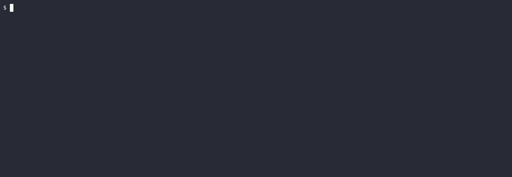

Data tables
===========

[Data tables][table] represent a handy way for passing a list of values to a [step] definition (and so, to a [step] matching function). This is a vital ability for writing [table driven tests][tdt].

```gherkin
Feature: Animal feature

  Scenario: If we feed a hungry animal it will no longer be hungry
    Given a hungry animal
      | animal |
      | cat    |
      | dog    |
      | 🦀     |
    When I feed the animal multiple times
      | animal | times |
      | cat    | 2     |
      | dog    | 3     |
      | 🦀     | 4     |
    Then the animal is not hungry
```

Data, declared in the [table], may be accessed via [`Step`] argument:
```rust
# use std::collections::HashMap;
#
use cucumber::{gherkin::Step, given, then, when, World};

#[given(regex = r"^a (hungry|satiated) animal$")]
async fn hungry_animal(world: &mut AnimalWorld, step: &Step, state: String) {
    let state = match state.as_str() {
        "hungry" => true,
        "satiated" => false,
        _ => unreachable!(),
    };

    if let Some(table) = step.table.as_ref() {
        for row in table.rows.iter().skip(1) { // NOTE: skip header
            let animal = &row[0];

            world
                .animals
                .entry(animal.clone())
                .or_insert(Animal::default())
                .hungry = state;
        }
    }
}

#[when("I feed the animal multiple times")]
async fn feed_animal(world: &mut AnimalWorld, step: &Step) {
    if let Some(table) = step.table.as_ref() {
        for row in table.rows.iter().skip(1) { // NOTE: skip header
            let animal = &row[0];
            let times = row[1].parse::<usize>().unwrap();

            for _ in 0..times {
                world.animals.get_mut(animal).map(Animal::feed);
            }
        }
    }
}

#[then("the animal is not hungry")]
async fn animal_is_fed(world: &mut AnimalWorld) {
    for animal in world.animals.values() {
        assert!(!animal.hungry);
    }
}

#[derive(Debug, Default)]
struct Animal {
    pub hungry: bool,
}

impl Animal {
    fn feed(&mut self) {
        self.hungry = false;
    }
}

#[derive(Debug, Default, World)]
pub struct AnimalWorld {
    animals: HashMap<String, Animal>,
}
#
# #[tokio::main]
# async fn main() {
#     AnimalWorld::run("tests/features/book/writing/data_tables.feature").await;
# }
```

> __NOTE__: The whole table data is processed during a single [step] run.




## Escaping

- To use a newline character in a table cell, write it as `\n`. 
- To use a `|` as a part in a table cell, escape it as `\|`. 
- And finally, to use a `\`, escape it as `\\`.


[`Step`]: https://docs.rs/gherkin/*/gherkin/struct.Step.html
[step]: https://cucumber.io/docs/gherkin/reference#steps
[table]: https://cucumber.io/docs/gherkin/reference#data-tables
[tdt]: https://dave.cheney.net/2019/05/07/prefer-table-driven-tests
